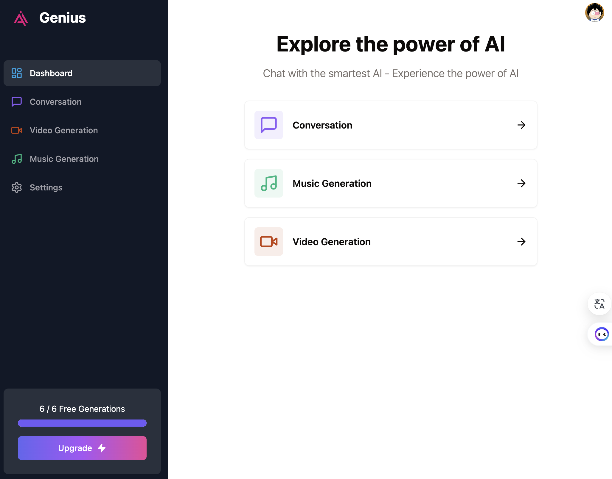

## Give it a star if u like it.
https://next-ai-platform.onrender.com/

demo video 👇
https://www.youtube.com/watch?v=3rfHoSe_oMU
## Features:

- Stripe monthly subscription
- Stripe Top up credits
- Free tier with API limiting
- RealTime Customer Support
- Tailwind design animations and effects
- Full responsiveness
- Clerk Authentication (Email, Google, 9+ Social Logins)
- Code Generation Tool (Yiyan AI)
- Video Generation Tool (Replicate AI)
- Conversation Generation Tool (Yiyan AI)
- Music Generation Tool (Replicate AI)
- Page loading state




### Prerequisites

**Node version 18.x.x**

### Install packages

```shell
npm i
```

### Setup .env file

```js
NEXT_PUBLIC_CLERK_PUBLISHABLE_KEY=
CLERK_SECRET_KEY=

NEXT_PUBLIC_CLERK_SIGN_IN_URL=/sign-in
NEXT_PUBLIC_CLERK_SIGN_UP_URL=/sign-up
NEXT_PUBLIC_CLERK_AFTER_SIGN_IN_URL=/dashboard
NEXT_PUBLIC_CLERK_AFTER_SIGN_UP_URL=/dashboard

OPENAI_API_KEY=
REPLICATE_API_TOKEN=

DATABASE_URL=

STRIPE_API_KEY=
STRIPE_WEBHOOK_SECRET=

NEXT_PUBLIC_APP_URL="http://localhost:3000"
```

### Setup Prisma

```shell
npx prisma db push

```

### Start the app

```shell
npm run dev
```

### strip

```shell
stripe listen --forward-to localhost:3000/api/webhook
```

## Available commands

Running commands with npm `npm run [command]`

| command | description                              |
| :------ | :--------------------------------------- |
| `dev`   | Starts a development instance of the app |

# next-ai-platform
